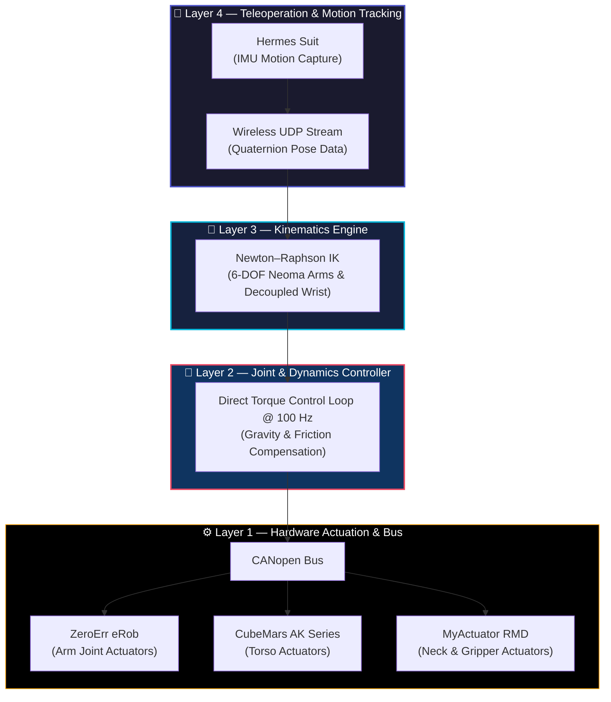

<!-- Video Showcase Header -->

  

## 📌 Project Overview

Prometheus 3.0 is a **20-DOF humanoid research platform** developed for immersive telepresence using an **Avatar–Hermes** architecture. The system allows a human operator wearing the Hermes motion-capture suit to control the humanoid's upper body in real time with high dynamic fidelity.

My contribution focused on developing the complete control stack—ranging from multibody Euler–Lagrange dynamics and numerical inverse kinematics to embedded firmware running across distributed microcontrollers.

    

        
    

    Overall architecture of the Prometheus 3.0 humanoid platform.

  <h5 class="mb-3" style="font-size: 1rem; font-weight: 600; text-transform: uppercase; letter-spacing: 0.05em; color: var(--global-theme-color);">Platform Key Specifications</h5>
  <ul class="mb-0 pl-4" style="line-height: 1.8;">
    <li><strong>20 Degrees of Freedom (DOF):</strong> Full upper-body articulation for natural motion mapping.</li>
    <li><strong>100 Hz Deterministic Control Loop:</strong> Real-time torque control running on embedded microcontrollers.</li>
    <li><strong>Automated Math-to-C++ Pipeline:</strong> Direct translation of MATLAB symbolic dynamics into C++ firmware.</li>
    <li><strong>Sub-Millimeter Repeatability:</strong> Calibrated using custom 3D-printed PLA metrology fixtures.</li>
  </ul>

## ⚙️ Engineering Challenge

Most commercial robotic actuators expose only position or velocity control interfaces, hiding the underlying motor dynamics and compliance.

For Prometheus 3.0, direct torque control was required to enable:

- **Gravity Compensation:** Dynamic load cancellation across all joints.
- **Custom Nonlinear Controllers:** Friction and inertia compensation.
- **Haptic Feedback:** Force transparency for the remote operator.
- **Dynamic Transparency:** Natural teleoperation response without rigid mechanical constraint.

An additional engineering challenge was translating complex symbolic dynamic models derived in MATLAB into deterministic C++ firmware capable of executing at **100 Hz** on embedded hardware.

## 🏗️ Control Architecture

To maintain software modularity and scalability, the control system was divided into four decoupled operational layers:

### Subsystem Breakdown

1. **Layer 1 — Actuation:** Distributed CANopen motor bus controlling ZeroErr eRob actuators (arms), CubeMars AK series (torso), and MyActuator RMD motors (neck and grippers).
2. **Layer 2 — Joint Control:** Embedded 100 Hz real-time loops executing joint torque control, gravity compensation, and friction modeling.
3. **Layer 3 — Kinematics:** Numerical inverse kinematics using the Newton–Raphson method for the 6-DOF Neoma arms with a decoupled spherical wrist assumption.
4. **Layer 4 — Teleoperation:** Wireless UDP streaming converting IMU quaternion orientation data from the Hermes suit into Cartesian end-effector targets.

## 🧮 Dynamic Modeling & Torque Control

Robot dynamics were mathematically derived using the **Euler–Lagrange formulation**.

To eliminate manual translation errors for long symbolic expressions, an automated pipeline was developed to compile MATLAB symbolic dynamic equations directly into optimized, deterministic C++ code.

### Torque Control Formulation

The embedded torque control law executed per joint is given by:

$$
\tau = G(q) - K_p e - K_d \dot{q} - K_e \cdot \mathrm{sgn}(e)\cdot |e|^{p_e}
$$

where $G(q)$ represents the dynamic gravity vector, and the nonlinear exponential term:

$$
|e|^{p_e}, \qquad p_e \in [0.2, 0.5]
$$

was tuned for each joint actuator to counteract harmonic drive friction without introducing the instability common to traditional integral gain terms.

    

        
    

    Embedded control loop executed on distributed microcontrollers.

## ⚡ Distributed Embedded Firmware

The software architecture was distributed across multiple **Teensy 4.1** and **ESP32** microcontrollers connected via CANopen bus.

Key firmware modules included:

- **Finite State Machine (FSM):** Handles mode transitions, homing routines, and system states.
- **Safety Monitoring & UDP Watchdogs:** Instant shutoff upon packet loss or joint limits.
- **Current-Based Gripper Homing:** Automatic homing routine detecting hard stops via motor current and velocity signatures, eliminating mechanical limit switches.

## 🏆 Results & Validation

The completed platform successfully demonstrated:

- **Real-Time Upper-Body Teleoperation** with low end-to-end latency.
- **Stable Torque Control & Gravity Compensation** across all joint links.
- **High-Fidelity Motion Tracking** mapped from human operator gestures.
- **Millimeter-Level Joint Repeatability** validated using custom 3D-printed PLA metrology calibration fixtures.

## 🛠️ Technology Stack

  C++
  MATLAB & Simulink
  Symbolic Math Toolbox
  Teensy 4.1
  ESP32
  CANopen
  UDP Networking
  Inverse Kinematics
  Euler–Lagrange Dynamics
  Finite State Machines
  Embedded Control

