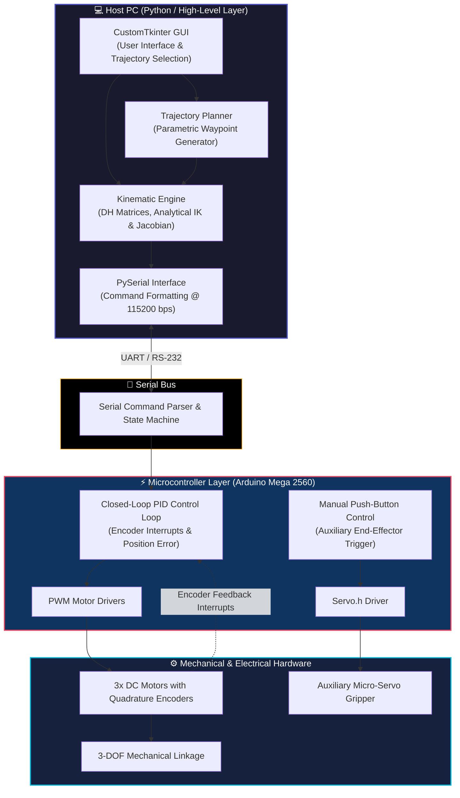

## 📌 Project Overview

An end-to-end mechatronic system featuring a 3-Degree-of-Freedom (3-DOF) robotic arm engineered for spatial positioning and trajectory execution. Built as a capstone mechatronics engineering project, this platform integrates analytical kinematic mathematical modeling, high-frequency closed-loop firmware control, and a modern Python graphical user interface.



  



  <h5 class="mb-3" style="font-size: 1rem; font-weight: 600; text-transform: uppercase; letter-spacing: 0.05em; color: var(--global-theme-color);">Key Technical Highlights</h5>
  <ul class="mb-0 pl-4" style="line-height: 1.8;">
    <li><strong>$\pm 1\text{ mm}$ Precision:</strong> Achieved sub-millimeter end-effector accuracy using closed-loop DC motor control with quadrature encoders and custom PID tuning.</li>
    <li><strong>Real-Time Trajectory Execution:</strong> Dynamic parametric trajectory generation allowing the manipulator to draw geometric primitives (circles, rectangles, triangles) with continuous velocity profiles.</li>
    <li><strong>Decoupled Architecture:</strong> Asynchronous system design splitting high-level mathematical calculations (Python) from real-time hardware execution (Arduino Mega firmware).</li>
  </ul>

  

    
      🔥 4M+ Views Showcase Demo on TikTok
    
  

  

    <blockquote class="tiktok-embed" cite="https://www.tiktok.com/@hec_moore/video/7308124947786829062" data-video-id="7308124947786829062" style="max-width: 400px; min-width: 320px;">
      <section>
        <a target="_blank" title="@hec_moore" href="https://www.tiktok.com/@hec_moore?refer=embed">@hec_moore</a>
        Con esto terminamos la carrera de Ingeniería Mecatrónica You can call me Engineer! 🫡
        <a title="estudiantesingenieria" target="_blank" href="https://www.tiktok.com/tag/estudiantesingenieria?refer=embed">#estudiantesingenieria</a>
        <a title="mecatronica" target="_blank" href="https://www.tiktok.com/tag/mecatronica?refer=embed">#mecatronica</a>
        <a title="ingenieriamecatronica" target="_blank" href="https://www.tiktok.com/tag/ingenieriamecatronica?refer=embed">#ingenieriamecatronica</a>
        <a title="robotica" target="_blank" href="https://www.tiktok.com/tag/robotica?refer=embed">#robotica</a>
      </section>
    </blockquote>
    
  

## 🏗️ System Architecture

The project features a decoupled, two-tier architecture designed to separate high-level mathematical computations from real-time hardware execution:

### Subsystem Breakdown

1. **High-Level Control (Python)**:
   - **GUI (`robot_interface.py`)**: Built using CustomTkinter for real-time Cartesian coordinate entry, manual joint control, and visual feedback.
   - **Kinematics Engine (`FK_3DOF.py`, `IK_3DOF.py`, `dh_matrix.py`, `GetJacobian3.py`)**: Solves analytical inverse kinematics and computes transformation and Jacobian matrices.
   - **Trajectory Planner (`Trajectories.py`)**: Generates linear, circular, rectangular, and triangular parametric path waypoints with continuous velocity profiles.

2. **Communication Protocol**:
   - Asynchronous serial interface over UART at $115,200\text{ bps}$. Packets transmit target joint angles and operational modes to the microcontroller.

3. **Low-Level Firmware (Arduino C++)**:
   - Non-blocking state machine running on an Arduino Mega 2560.
   - Reads hardware quadrature encoders via external interrupts for precise real-time angular feedback.
   - Executes independent PID loops per joint to regulate PWM output to motor drivers.

## 📐 Kinematics & Mathematical Modeling

The manipulator features 3 revolute joints. Spatial positioning of the end-effector is modeled rigorously using standard Denavit-Hartenberg (DH) parameters and closed-form analytical inverse kinematics.

  

    📖 Click to expand full mathematical derivation (DH Parameters, Analytical IK & Jacobian Matrix)
  

  

    <h5 class="font-weight-bold">1. Denavit-Hartenberg (DH) Parameters</h5>
    
Each link transformation $T_{i-1}^i$ is computed from the homogeneous DH transformation matrix:

    $$
    T_{i-1}^i = \begin{bmatrix} 
    \cos\theta_i & -\sin\theta_i \cos\alpha_i & \sin\theta_i \sin\alpha_i & a_i \cos\theta_i \\ 
    \sin\theta_i & \cos\theta_i \cos\alpha_i & -\cos\theta_i \sin\alpha_i & a_i \sin\theta_i \\ 
    0 & \sin\alpha_i & \cos\alpha_i & d_i \\ 
    0 & 0 & 0 & 1 
    \end{bmatrix}
    $$

    

      <table class="table table-bordered text-center" style="font-size: 0.9rem;">
        <thead>
          <tr>
            <th>Link ($i$)</th>
            <th>$\theta_i$ (rad)</th>
            <th>$d_i$ (cm)</th>
            <th>$a_i$ (cm)</th>
            <th>$\alpha_i$ (rad)</th>
          </tr>
        </thead>
        <tbody>
          <tr><td><strong>1</strong></td><td>$\theta_1^*$</td><td>$L_1 = 15.0$</td><td>$0$</td><td>$+\pi/2$</td></tr>
          <tr><td><strong>2</strong></td><td>$\theta_2^*$</td><td>$0$</td><td>$L_2 = 22.0$</td><td>$0$</td></tr>
          <tr><td><strong>3</strong></td><td>$\theta_3^*$</td><td>$d = -6.5$</td><td>$L_3 = 18.0$</td><td>$0$</td></tr>
        </tbody>
      </table>
    

    <h5 class="font-weight-bold mt-4">2. Analytical Inverse Kinematics (IK)</h5>
    
Given a target Cartesian coordinate $(x_c, y_c, z_c)$, the joint angles $(\theta_1, \theta_2, \theta_3)$ are computed analytically:

    <ul>
      <li><strong>Base Angle ($\theta_1$):</strong> 
        $$r = \sqrt{x_c^2 + y_c^2 - d^2}, \quad \theta_1 = \text{atan2}(y_c, x_c) - \text{atan2}(d, r)$$
      </li>
      <li><strong>Elbow Angle ($\theta_3$):</strong> 
        $$\cos\theta_3 = \frac{x_c^2 + y_c^2 - d^2 + (z_c - L_1)^2 - L_2^2 - L_3^2}{2 L_2 L_3}, \quad \theta_3 = \text{atan2}(\sqrt{1 - \cos^2\theta_3}, \cos\theta_3)$$
      </li>
      <li><strong>Shoulder Angle ($\theta_2$):</strong> 
        $$s = -(z_c - L_1), \quad \theta_2 = \text{atan2}(s, r) - \text{atan2}(L_3 \sin\theta_3, L_2 + L_3 \cos\theta_3)$$
      </li>
    </ul>

    <h5 class="font-weight-bold mt-4">3. Differential Kinematics & Velocity Control</h5>
    
Cartesian velocity transformation via the $6 \times 3$ Jacobian matrix $J(\mathbf{q})$:

    $$\mathbf{v} = J(\mathbf{q}) \dot{\mathbf{q}}$$
    $$
    J(\mathbf{q}) = \begin{bmatrix}
    \mathbf{z}_0 \times (\mathbf{o}_3 - \mathbf{o}_0) & \mathbf{z}_1 \times (\mathbf{o}_3 - \mathbf{o}_1) & \mathbf{z}_2 \times (\mathbf{o}_3 - \mathbf{o}_2) \\
    \mathbf{z}_0 & \mathbf{z}_1 & \mathbf{z}_2
    \end{bmatrix}
    $$
  

## ⚡ Firmware & Hardware Control

The low-level controller handles interrupt-driven encoder decoding, state parsing, and closed-loop motor control on the **Arduino Mega 2560**.

- **High-Frequency Encoder ISRs:** Quadrature encoders generate high-frequency pulses on external interrupt pins, maintaining exact angular position tracking for all 3 DC motors.
- **Closed-Loop PID Control:** Individual discrete-time PID position control loops continuously compute error $e(t) = \theta_{target} - \theta_{current}$ to modulate motor PWM driver signals.

  <h4 class="mb-3">🖼️ Hardware & Circuit Gallery</h4>
  

    

      
    

    

      
    

  

  

    Left: Assembled 3-DOF mechanical manipulator arm. Right: Control electronics, H-bridge motor drivers, and Arduino Mega wiring board.
  

  <h5 style="color: #e94560; font-size: 1rem; font-weight: 600; text-transform: uppercase; letter-spacing: 0.05em;">💡 Rapid Prototyping & Engineering Trade-Offs</h5>
  <ul class="mb-0 mt-2" style="font-size: 0.95rem; line-height: 1.7;">
    <li><strong>3-Week Capstone Constraint:</strong> The entire system—from mechanical machining to kinematic math and custom firmware—was developed within a strict 3-week window.</li>
    <li><strong>Auxiliary Servo Gripper Trade-Off:</strong> The end-effector included a micro-servo tool for object grasping. Due to time constraints and to avoid potential timer/interrupt contention between Arduino's <code>Servo.h</code> library and the high-frequency motor encoder ISRs, the team made a strategic trade-off: <strong>gripper control was offloaded to a direct physical push-button trigger</strong> rather than passing through serial GUI commands. This allowed us to guarantee zero-latency end-effector actuation without compromising the primary 3-DOF kinematic control loop.</li>
  </ul>

## 👥 Team & Contributions

- **Andrés Alemán** – Control Systems, Kinematic Modeling & Lead Software Development ([@andresalemn](https://github.com/andresalemn))
- **Héctor Moore** – Mechanical Design, CAD Assembly & Physical Fabrication
- **Ricardo Villanueva** – Power Electronics, Circuit Integration & Hardware Testing

